# 🎬 React Native TMDB App

This is a **React Native** project built with **Expo**, which allows users to browse movies and TV shows using **The Movie Database (TMDB) API**.

## 📜 INSTRUCTIONS

### 1️⃣ Clone this repository

### 2️⃣ Install dependencies:

```sh
npm install
```

(or use yarn install if you're using Yarn.)

### 3️⃣ Configure API Key

- Copy the file apiConfig_example.js and rename it to **apiConfig.js**.
- Open apiConfig.js and replace YOUR_TMDB_TOKEN with your TMDB API key.

### 4️⃣ Run the project

```sh
npx expo start
```

## 🎬 THE PROJECT

This app is built using React Native with Expo to provide a seamless experience across iOS and Android.

🔹 Technologies Used

- Expo - For fast development and testing

- React Navigation - For managing screens and navigation

- Axios - For making HTTP requests to TMDB API

- Gluestack UI - For modern and customizable UI components

## 📸 SCREENSHOTS

| Android                                                          | iOS                                                          |
| ---------------------------------------------------------------- | ------------------------------------------------------------ |
| 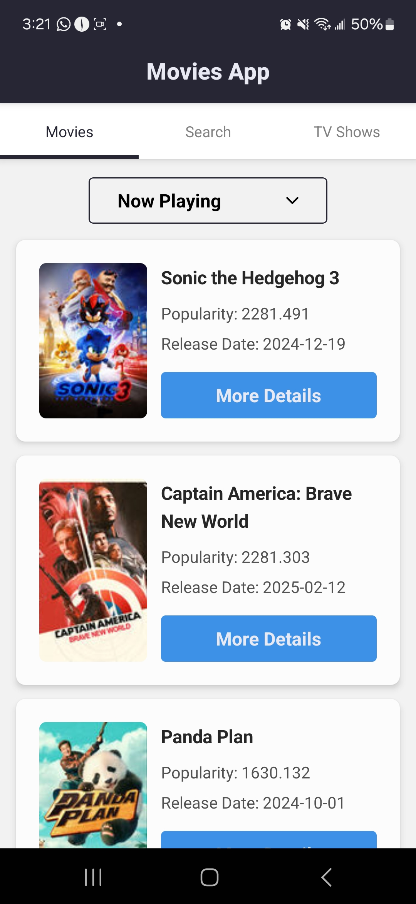 | 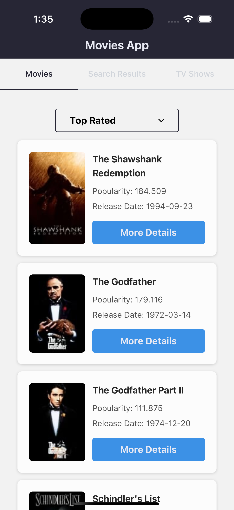 |
| 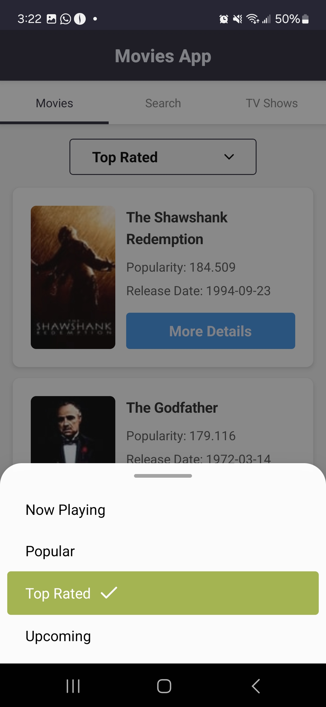 | 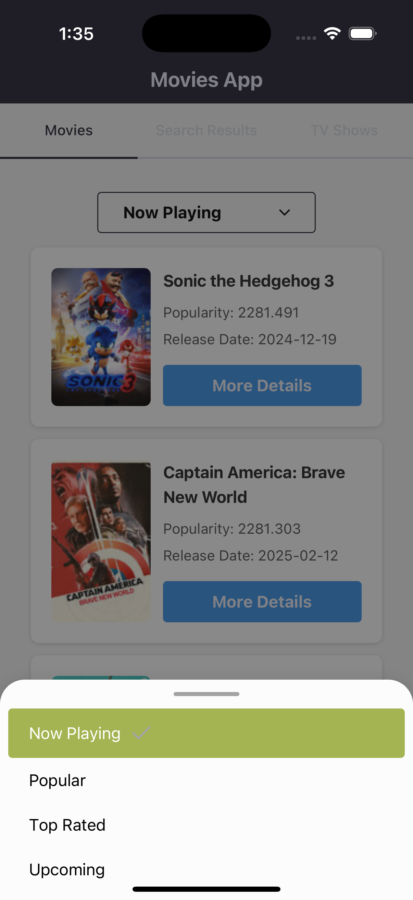 |
| 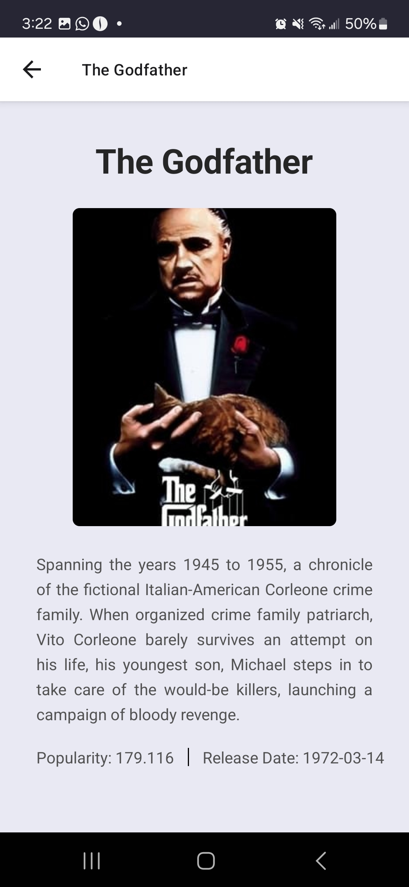 | 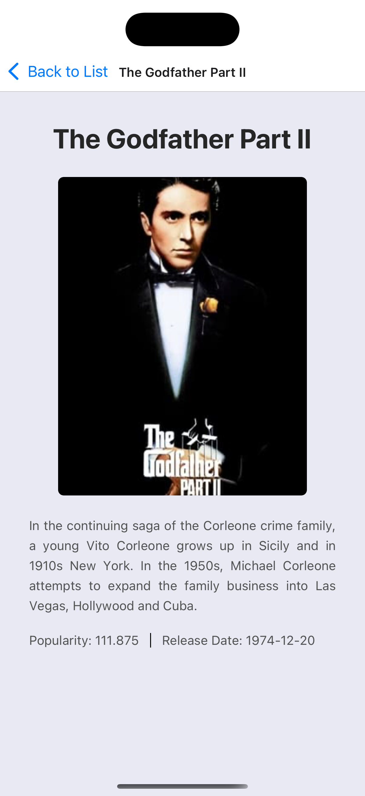 |
| 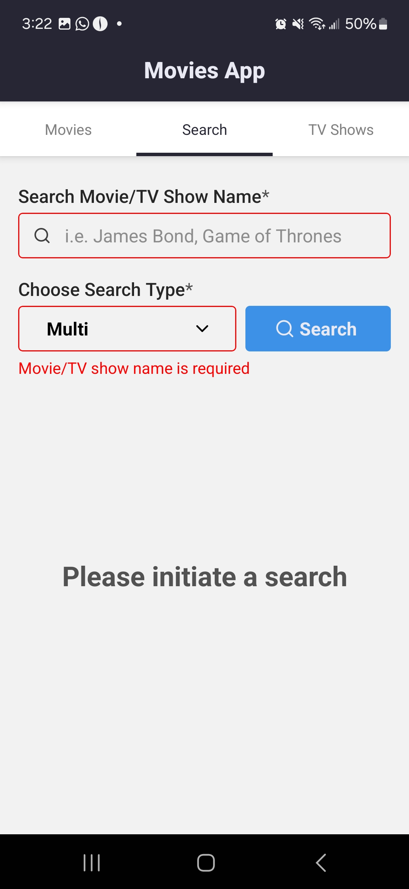 | 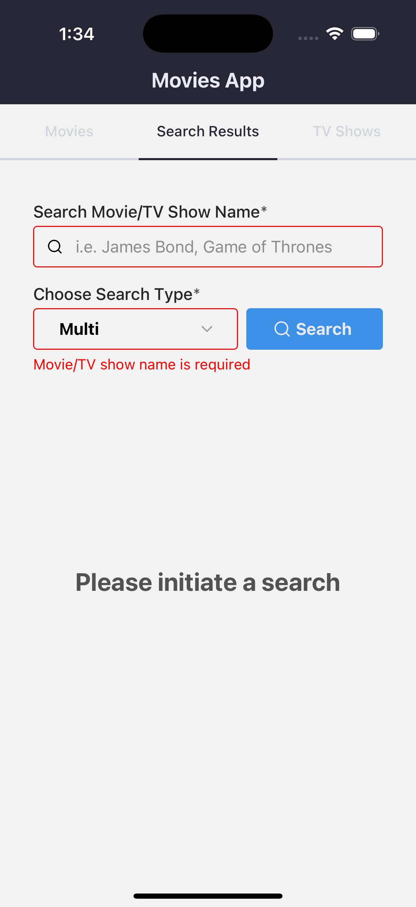 |
| 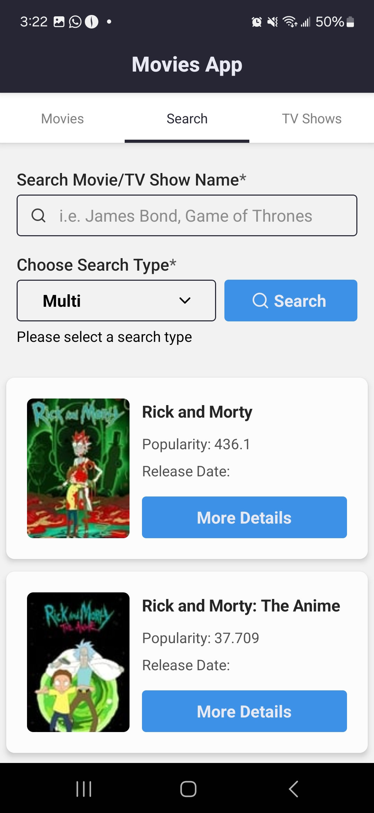 | 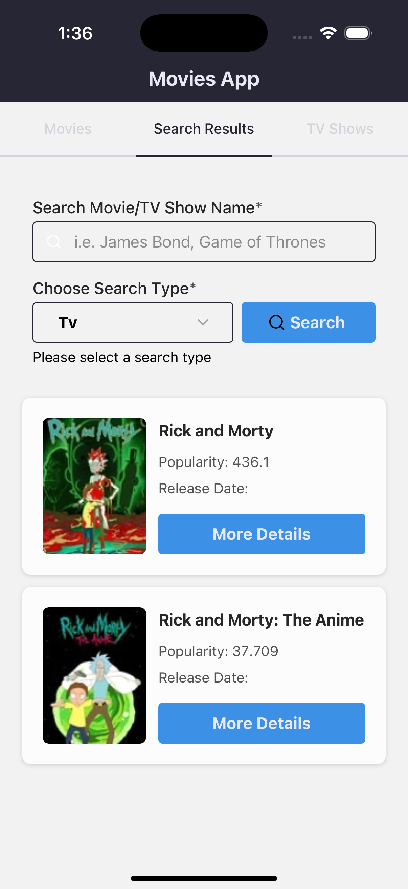 |
| 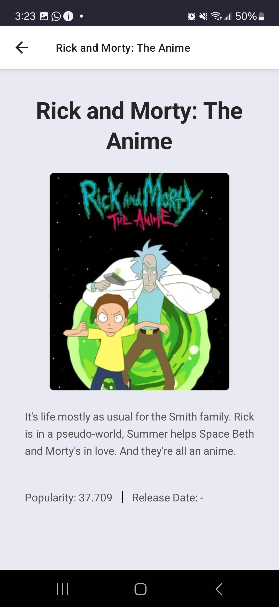 | 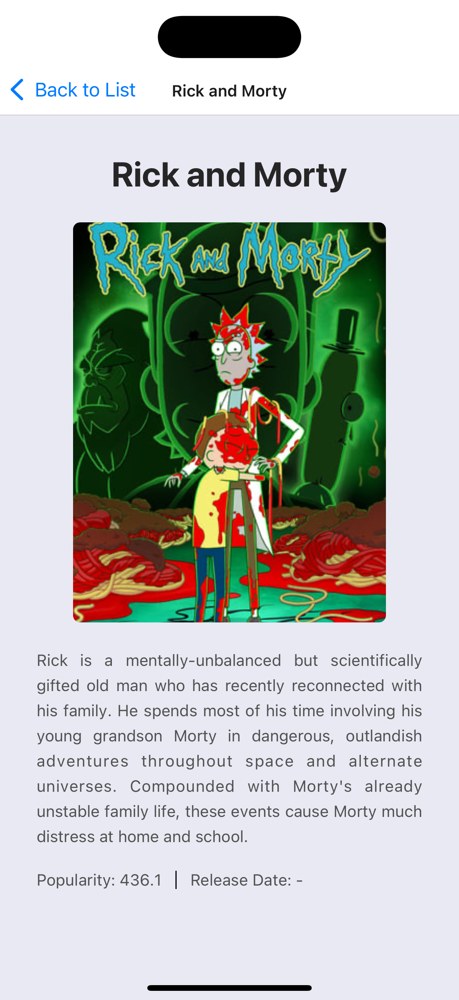 |
| 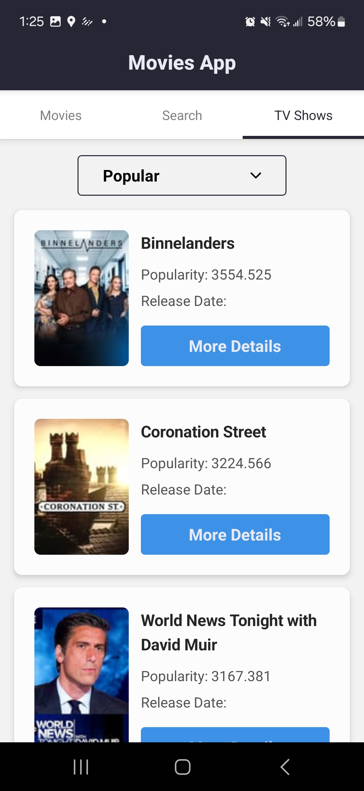     | 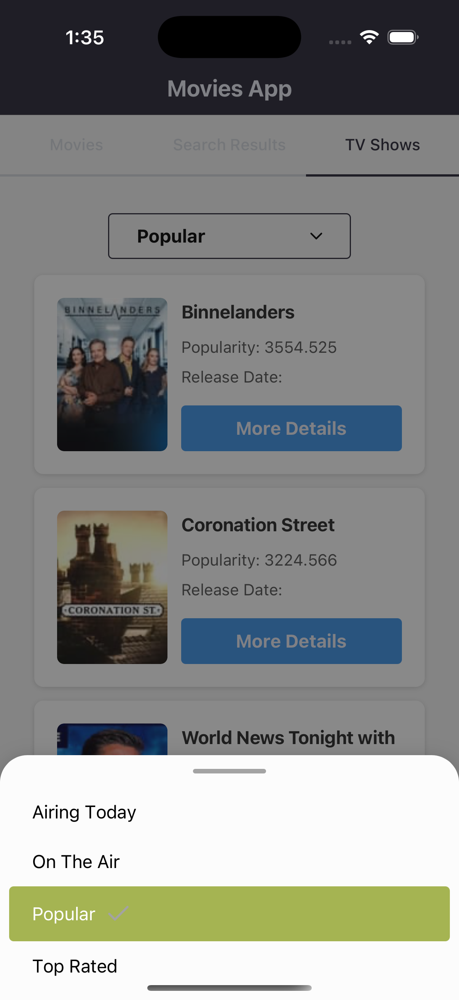     |
| 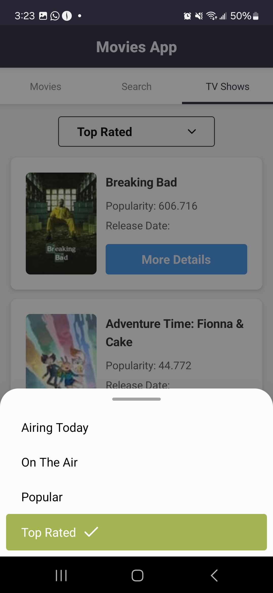     | 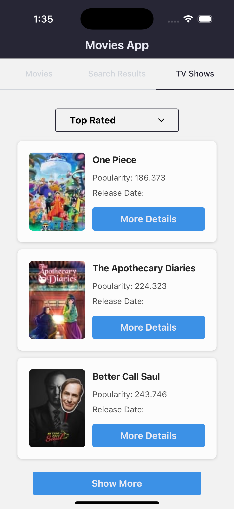     |
|      | 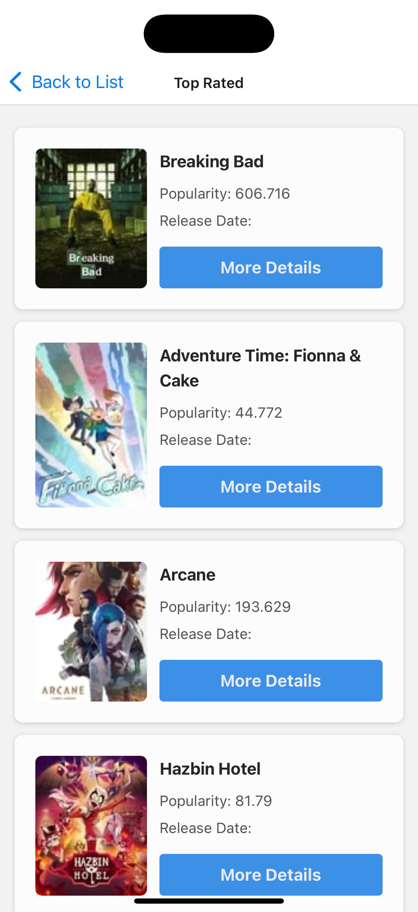     |
| 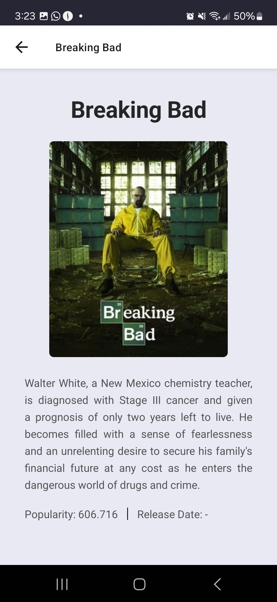     | 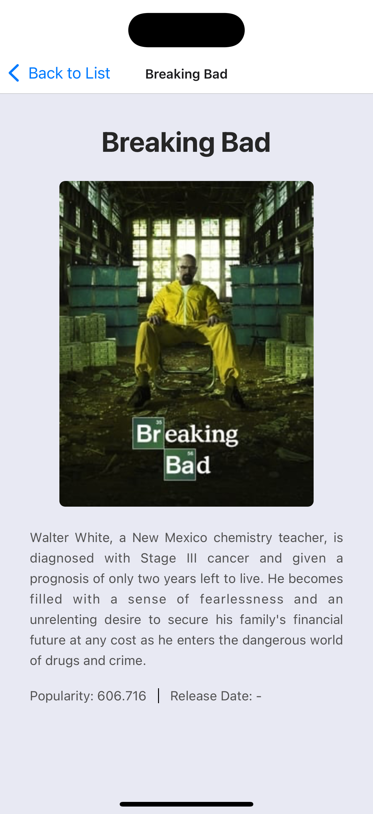     |
